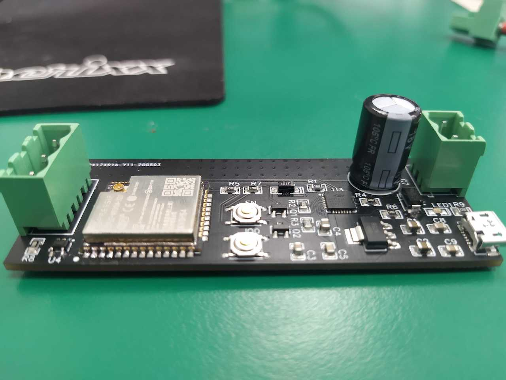
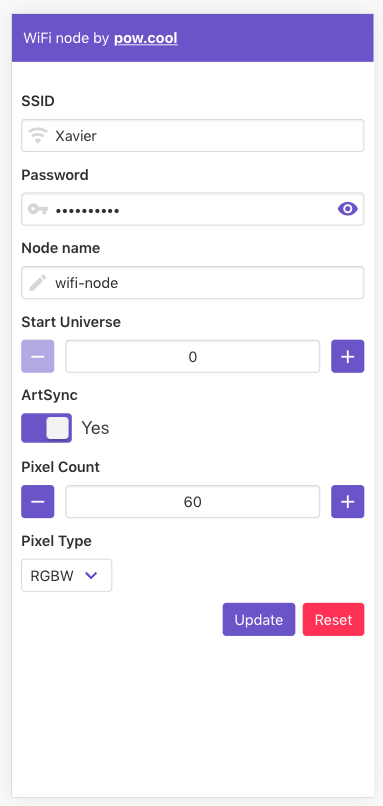

# wifi-artnet

Control "smart LEDs" (ws281x and sk6812) through Art-Net over WiFi! The board embeds a web server to configure it.





## Prerequisites

- platformio cli: https://docs.platformio.org/en/latest/core/installation.html
- node.js 12.14.1+: https://nodejs.org/en/

## Hardware

### Schematics and PCB

https://easyeda.com/xavier.seignard/wifi-artnet

### BOM

You can find the BOM here: [BOM.md](./docs/BOM.md)

## Development

```
npm install
```

### Develop web interace

```
npm run serve
```

### Upload firmware

```
npm run upload
```

or

```
pio run -t upload
```

### Upload web page

```
npm run uploadfs
```

or

```
pio run -t uploadfs
```

### Upload firmware AND web page to esp32

```
npm run build
```
